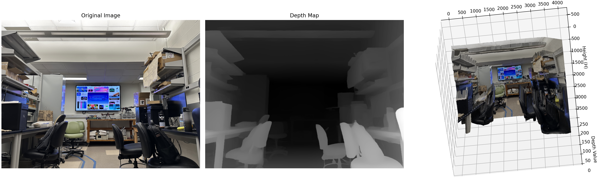

## Purpose
This is a simple depth estimation testing repository used for performing depth estimation after 5G data transmission to the base station in course 594. We use Depth Anything V2; for more details, please refer to https://github.com/DepthAnything/Depth-Anything-V2

## Usage

### Prepraration

```bash
git clone https://github.com/PeaceNeil/Depth_Estimator_594.git
cd Depth_Estimator_594
pip install -r requirements.txt
wget https://huggingface.co/depth-anything/Depth-Anything-V2-Small/resolve/main/depth_anything_v2_vits.pth
```

Or download other checkpoints listed [here](https://github.com/DepthAnything/Depth-Anything-V2?tab=readme-ov-file#pre-trained-models).

### Infer one frame
Added a simple script for depth estimation and a 3D surface visualization.
```bash 
python DispAnything.py --image_path IMAGE_PATH --encoder MODEL_TYPE
```



